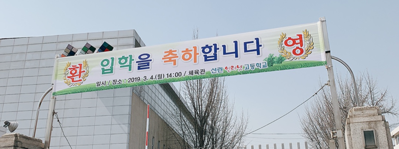

### 💁‍2019년 03월 04일 입학을 하다

필자는 2019년 03월 04일 선린인터넷고등학교 **IT 경영과**로 입학을 하게 되었습니다.  
하지만 처음부터 선린인터넷고등학교를 지원한 것은 아니였습니다.  
  
처음 지원한 학교는 **한국디지털미디어고등학교**라는 경기도 안산에 위차한 IT 특성화 학교였습니다.  
중학교 3학년 때 한국디지털미디어고등학교를 알게 되었고 차근차근 준비하였습니다.  
하지만, 예상했던 결과와 다르게 합격자 명단엔 제 이름이 없었고 그날 저는 **인생에서 제일 불행한 날**이였습니다.  
  
저는 떨어진 이후 실망하지 않고 인문계를 가는 것보단 다른 특성화를 가서  
내가 하고 싶은 거하고 사는 것이 좋다고 생각을 하였습니다.  
  
그러하여 저는 중학교 3학년 담임선생님을 설득하여 선린인터넷고등학교 **일반전형**에 지원하게 되었습니다.  
다행스럽게 결과는 합격이었지만 원하는 과는 아니였습니다. 하지만, 원하는 과가 아니더라도 저는 주어진 위치에서  
열심히 노력하고 행동하면 원하던 과에 있는 것보다 **더 많은 히스토리를 만들 수 있다고 생각하게 되었습니다.**  
  
그래서 저는 2019년 03월 04일 선린인터넷고등학교를 입학하게 되었습니다.